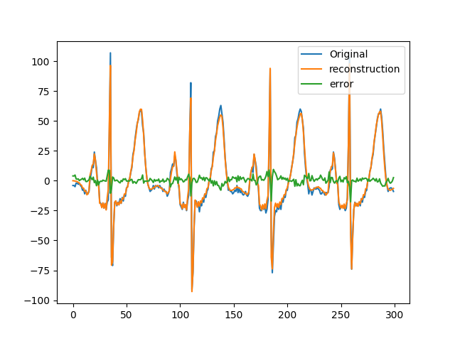
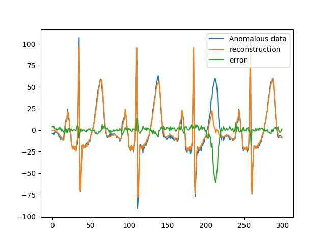

# Anomaly-Detection-with-K-means

This is simple implementation of anomaly detection based on k-means clustering.
URL : http://amid.fish/anomaly-detection-with-k-means-clustering

Algorithm 

1. Sampling normal data (input: time series, output: segmented time series)

2. Make starting and end points zero, multiplying window functions. (input: output of 1 , output windowed segments)

3. Learn K-means clustering model.

4. Construct reconstruction model.
  4-1) sampling original data.
  4-2) Find closest cluster centroid of each sampled segment.
  4-3) Reconstuct data with 4-2 result.
  
5. Decide anomaly based on reconstruction error.

Result Example 1

Result Example 2

